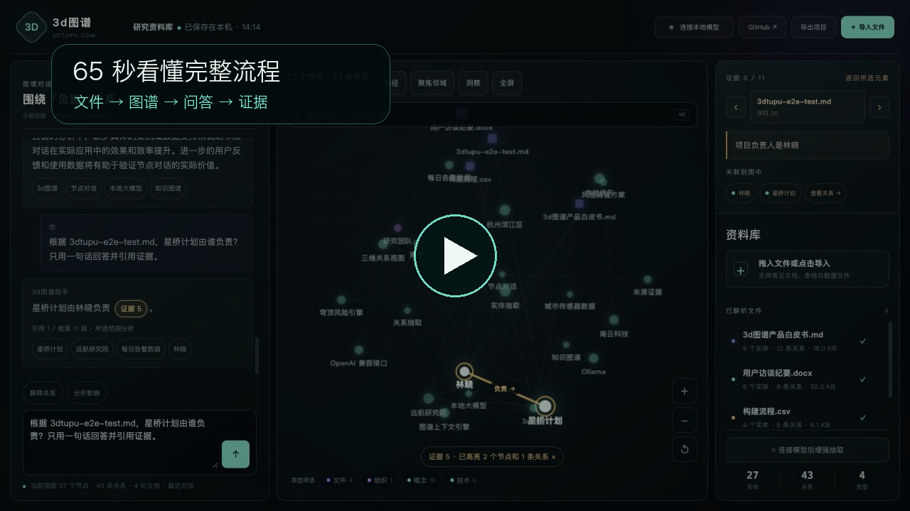

# 3d图谱（3dtupu）

> 让复杂关系可见、可问、可推理。

[打开 3dtupu.com](https://3dtupu.com)

## 65 秒看懂完整流程

`导入文件 → 大模型全库建图 → 选择节点或关系 → 围绕图谱提问 → 点击证据核验`

[▶ 播放中文字幕演示（无配音）](https://3dtupu.com/demo/3dtupu-product-demo-v2.mp4)

## 产品能力

- 把 PDF、Word、PowerPoint、Excel、网页和结构化数据转换为可交互 3D 图谱
- 扫描 PDF 与 PNG/JPEG/WebP 可由视觉模型读取，并通过第二次独立看图复核补全证据
- 使用大模型完成全文理解、跨文件实体消歧、关系复核与证据完整性校验
- 点击节点、关系或路径即可围绕当前视图继续提问
- 回答同时结合图谱结构与文档原文，并可回到来源证据核验
- 支持 Ollama 及 OpenAI 兼容接口，适合本地模型和企业私有化场景
- 建图失败时不会用半成品覆盖原图，无法验证的内容不会进入正式图谱

含图片、图表或连接图形的 Office 文件建议先导出为 PDF，以保留真实页面布局并避免读取被裁剪、遮挡或已删除的媒体内容。

## 企业合作

本公开仓库仅用于产品展示和承载官方网站发布文件，不提供核心建图引擎源码。

企业评估、商业使用、内部部署、私有化交付、系统集成、定制开发和源码访问，
均需事先取得书面授权并商议合作方案。

合作入口：[3dtupu.com](https://3dtupu.com)

## 许可

本仓库不是开源软件。除访问官方网站和查看产品资料所必需的范围外，不授予
复制、修改、分发、部署、商用、托管或再许可本仓库内容的权利。详见
[LICENSE](./LICENSE)。第三方组件继续适用其各自许可证。
