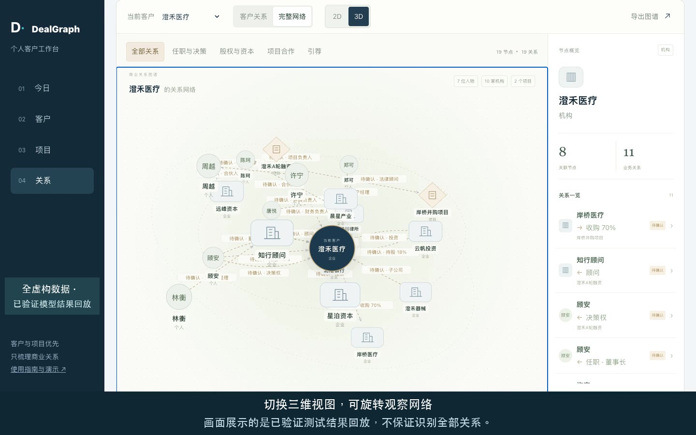

# DealGraph · 精品投行客户关系工作台

把商业聊天整理成客户、项目和关系，再记录下一步。以客户关系为主，沟通频率不是判断业务关系的依据。

使用入口：[3dtupu.com](https://3dtupu.com)。本说明对应 **2026-09-09 · 0.5.0 中文版**。

## 先体验

1. 打开网站，先浏览虚构示范的「今日 / 客户 / 项目 / 关系」。不需要模型密钥。
2. 点击「导入聊天」，选择「试用虚构聊天」，检查日期范围与实际待发送文本。
3. 要运行模型，再填自己的服务商 API 密钥。发现节点、解析关系分别确认、分别计费。
4. 完成后用「加密保存」下载工作台；下次用「打开文件」恢复。刷新或关闭会丢失未保存内容。

[中文上传说明](docs/UPLOAD.zh-CN.md) · [部署说明](docs/DEPLOY.zh-CN.md) · [测试与局限](docs/TESTING.zh-CN.md) · [网站中文指南](https://3dtupu.com/guide.html)

演示与示例：[中文字幕演示视频](https://3dtupu.com/demo/dealgraph-demo-zh.mp4)、[全虚构聊天示例](https://3dtupu.com/examples/wechat-noisy.synthetic.json)、[加密工作台示例](https://3dtupu.com/examples/demo-workbench.dgvault)。视频仅含虚构数据；节点名单按实测记录重建回放，关系解析回放已跑通结果，不是实时调用。示例保存密码：`Demo2026!Graph`，绝不能用于真实客户资料。

## 能做什么

- 客户与项目：任职、决策权、股权投资、企业借贷、并购、顾问、项目角色和商务引荐。
- 跟进：随手记、项目阶段、参与方接洽状态、待办与到期日；不自动发送消息或手机提醒。
- 关系：2D / 3D 切换，显示方向、项目与引荐人，区分待确认、历史、否定和冲突。
- 保存：浏览器内加密下载个人工作台，包含材料、关系快照、记录和待办，不包含 API 密钥或上传授权。

## 必须知道

目前是个人文件工作台，不是团队云端 CRM。不登录、不自动读取微信、不重签微信、不接入 iPhone 备份。聊天导入只支持 **Murmur 单会话 JSON v1**，不是所有微信导出工具通用格式；图片、语音、文件和分享卡片不解析。

选择文件先在浏览器处理；只有明确同意后，所选文本才经网站服务器发给所选模型服务商。日常内容可能仍在文本中，上传前请排除。密钥是用户自带，不使用站长共享额度。加密文件保护离线保存，不保护已解锁页面或被控制的设备；密码至少 12 字符，丢失无法找回。

本次含噪虚构测试：原样本明确关系找到 18/19；新样本找到 15/15，但人工补了两个机构，角色和更正仍有缺口。不能宣传为全自动或总体准确率 100%。详见[完整测试口径](docs/TESTING.zh-CN.md)。

## GitHub 与源码

[公开仓库 yanlinc-hue/3dtupu](https://github.com/yanlinc-hue/3dtupu) 只发布编译后的网页、中文文档和全虚构示例，**不是可直接执行 npm run dev 的源码仓库**。

源码位于私有仓库 `yanlinc-hue/3dtupu-core` 的 `dealgraph/`，部署前须取得访问与使用权限。请勿把源码、真实聊天、客户文件、密钥或运行日志提交到公开仓库；本次发布不改变源码私有状态。Murmur 及第三方组件的许可声明随发布保留。
